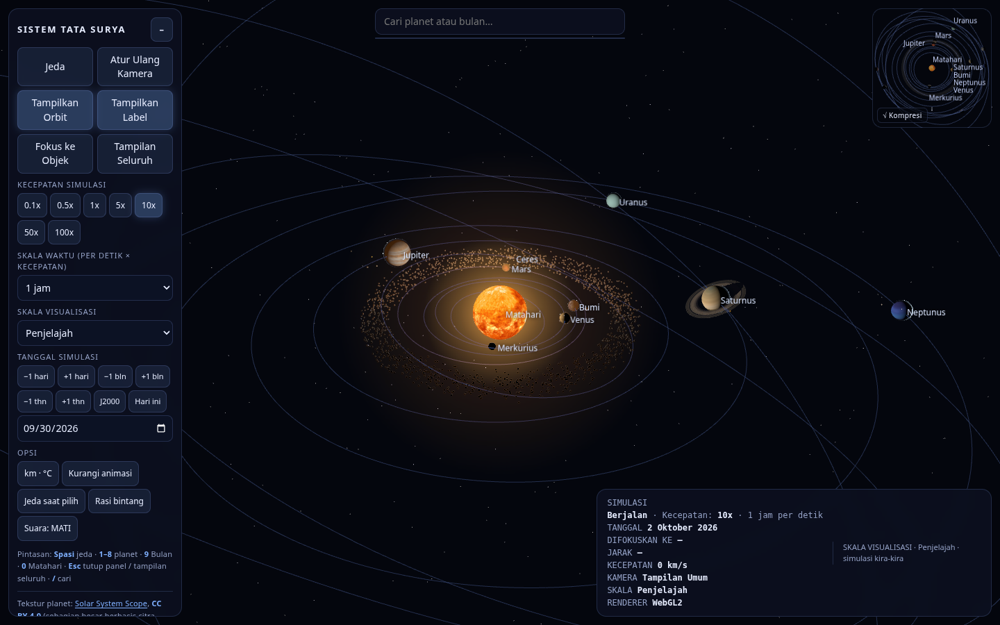
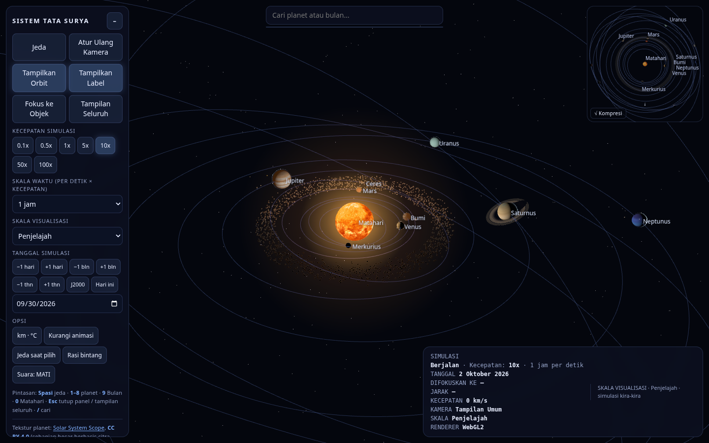
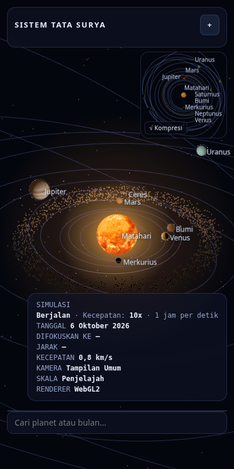

<div align="center">

# Solar System Explorer

**Visualisasi 3D tata surya interaktif yang berjalan sepenuhnya di peramban —
tanpa build step, tanpa backend, dan 100% offline.**

[](https://mifada2543.github.io/SolarSystem/)
[](LICENSE)
[](https://threejs.org/)
[](#teknologi)
[](#menjalankan)
[](assets/textures/ATTRIBUTION.txt)

**[English](README.en.md)** · Bahasa Indonesia

</div>

---

## Demo langsung

Aplikasi sudah tayang di GitHub Pages — cukup buka, tanpa pemasangan apa pun:

**👉 [mifada2543.github.io/SolarSystem](https://mifada2543.github.io/SolarSystem/)**



---

## Ringkasan

Solar System Explorer menyajikan seluruh tata surya dalam satu halaman HTML. Posisi
planet dihitung dari **elemen orbit JPL (epoch J2000)**, bukan lingkaran hiasan, sehingga
konfigurasi yang tampil benar-benar mengikuti tanggal simulasi yang kamu pilih.

Tiga hal yang membedakannya:

- **Offline sepenuhnya** — three.js, 19 tekstur 2K, CSS, dan seluruh modul ikut
  disertakan di folder proyek. Nol permintaan ke luar, jadi aplikasi tetap jalan
  tanpa koneksi internet.
- **Renderer modern** — `WebGPURenderer` dengan mundur otomatis ke WebGL2 bila WebGPU
  tidak tersedia, memakai TSL (*Three Shading Language*) untuk shader kustom.
- **Tanpa build step** — murni ES modules + `importmap`. Tidak ada `npm install`,
  bundler, atau konfigurasi apa pun.

---

## Daftar isi

- [Fitur](#fitur)
- [Pratinjau](#pratinjau)
- [Menjalankan](#menjalankan)
- [Kontrol](#kontrol)
- [Skala visualisasi](#skala-visualisasi)
- [Arsitektur](#arsitektur)
- [Teknologi](#teknologi)
- [Data & atribusi](#data--atribusi)
- [Catatan pengembangan](#catatan-pengembangan)
- [Lisensi](#lisensi)

---

## Fitur

### Simulasi

- **Orbit Kepler** — posisi planet dihitung dari elemen orbit JPL (epoch J2000), bukan
  lingkaran hiasan.
- **Rotasi Matahari** — memakai data rotasi 607,1 jam (25,3 hari) dengan kemiringan sumbu
  7,25°. Sebelumnya diputar oleh konstanta hardcoded `0,004 rad/hari` (1 putaran ±4,3 tahun),
  sehingga Matahari praktis tampak tidak berotasi.
- **Barycenter** — Matahari tidak lagi terkunci di titik dunia (0,0,0): ia bergerak
  mengelilingi pusat massa sistem (amplitudo ±0,5–1,5 radius Matahari, didominasi periode
  Jupiter 11,86 tahun), dan `sunLight` ikut bergeser sehingga arah datangnya cahaya tetap
  benar. Tombol `Barycenter` (panel Opsi) menampilkan penanda titik pusat massa beserta
  garis penghubungnya ke Matahari.
- **Kecepatan simulasianya** `0,1×` sampai `100×`, dengan satuan waktu per detik
  (menit → tahun) dan pemilih tanggal simulasi, termasuk lompatan `±1 hari` / `±1 bulan`
  / `±1 tahun`, tombol `J2000` dan `Hari ini`, serta pemilih tanggal kustom.
- **Satuan ganti cepat** metric ↔ imperial (`km · °C` ↔ `mi · °F`).

### Visualisasi

- **Tiga skala** — `Penjelajah` (ukuran & jarak sama-sama dikompres), `Relatif`, dan
  `Saintifik (≈1:1)` di mana 1 satuan dunia = 10⁶ km.
- **Tekstur planet 2K** tersimpan lokal dengan **cadangan prosedural otomatis** — bila
  berkas gagal dimuat, tampilan tetap utuh tanpa pesan galat.
- **Rasi bintang**, sabuk asteroid dengan ukuran titik berbasis piksel, lintasan elips
  7 bulan (Bulan, Io, Europa, Ganymede, Callisto, Titan, Triton — dibentuk dari
  eksentrisitas masing-masing) yang muncul otomatis saat
  induknya cukup dekat, lampu kota malam Bumi, atmosfer, dan bayangan cincin Saturnus.
- **Sabuk Kuiper** di luar orbit Neptunus — ±2.600 partikel dalam dua populasi:
  klasik "dingin" (42–47 SA, pita tipis) dan "panas" (30–50 SA, lebih tebal dan miring).
  Selalu tampil tanpa tombol khusus, dan tampil pula sebagai pita samar di peta navigasi.
  Keacakannya memakai PRNG lokal berbenih tetap, sehingga **tidak menggeser** benih
  `rnd()` bersama — sabuk asteroid, warna bintang, dan tekstur lama tetap identik.
- **22 rasi bintang** — Orion, Kalajengking, Beruang Besar, … bergaris sesuai figuran resmi
  **Sky & Telescope 2014** (yang juga dipakai Stellarium), plus **titik bintang** di setiap
  simpulnya dengan besar mengikuti magnitudo (≈1,7–6,8 px). Labelnya nama Indonesia dan
  otomatis **tidak tumpang tindih**: rasi dengan bintang terang diprioritaskan, sisanya
  menunggu sampai ada ruang kosong di layar.

### Navigasi

- **Peta navigasi 3D** di pojok kanan atas — scena terpisah yang dijepit ke *scissor
  viewport* pada renderer yang sama. Pusat peta tetap Matahari, sedangkan arah hadapnya
  mengikuti kamera utama. Dua tipe layout dapat dibandingkan lewat tombol
  `Kompresi` ↔ `Linier 1:1`, dan peta **membesar sendiri** saat disorot
  (172 → 236 px; 148 → 200 px di layar sempit).

  Klik planet untuk terbang, klik area kosong untuk menjelajah — arah pandang tetap
  dipertahankan.

  

- **Pencarian dua bahasa** — `earth` menemukan `Bumi`, `sun` menemukan `Matahari`.
- **Zoom otomatis memfokuskan** planet yang berada di bawah kursor.

### Antarmuka

- **Kartu HUD** di pojok kanan bawah: status simulasi, tanggal, `DIFOKUSKAN KE`,
  `JARAK` (kamera → objek terfokus), `KECEPATAN` (selalu tampil, termasuk `0 km/s`),
  kamera, skala, renderer.
- **Panel informasi** per objek berisi data fisik, orbit, atmosfer, dan deskripsi ringkas,
  plus tombol `Jelajahi {nama}` untuk mengorbit dari dekat dan `Tutup` untuk kembali
  ke kamera sebelumnya.
- **Responsif** dari layar lebar sampai ponsel 400 px, serta dukungan
  *prefers-reduced-motion*.
- **Tanpa emoji** — seluruh antarmuka memakai kata dan simbol tipografi biasa.

---

## Pratinjau

| Desktop | Ponsel |
|---|---|
|  |  |

---

## Menjalankan

### 1. GitHub Pages (termudah)

Buka **[mifada2543.github.io/SolarSystem](https://mifada2543.github.io/SolarSystem/)**
— tidak perlu mengunduh apa pun.

### 2. XAMPP

Taruh folder proyek di `htdocs`, lalu buka:

```
http://localhost/SolarSystem/
```

### 3. Server statis apa pun

```bash
python3 -m http.server 8000
# → http://localhost:8000/
```

### Catatan penting

Modul ES tidak bisa dimuat lewat `file://` (diblokir kebijakan CORS), jadi halaman harus
dilayani lewat HTTP. Buka `index.html` langsung dari berkas pun bisa — halaman itu sendiri
yang akan menjelaskan caranya.

**Prasyarat:** peramban modern yang mendukung ES modules — Chrome / Edge / Firefox /
Safari terbaru. Seluruh berkas dilayani dari lokal: three.js di `assets/lib/`, tekstur di
`assets/textures/`, modul di `assets/js/` — nol permintaan ke luar, sehingga aplikasi
**100% offline** selama folder ini tersedia. (Tautan kredit di panel hanya terbuka bila
diklik.)

---

## Kontrol

### Papan ketik & tetikus

| Aksi | Cara |
|---|---|
| Mengorbit kamera | seret dengan kursor |
| Zoom | gulir roda — sambil **otomatis memfokuskan** planet di bawah kursor |
| Fokus ke objek + panel info | klik planet / Bulan, atau pilih dari hasil pencarian |
| Jelajahi dari dekat | di panel info, klik `Jelajahi {nama}` |
| Bingkai ulang objek terpilih | tombol `Fokus ke Objek` |
| Terbang lewat peta | klik planet di peta, atau klik area kosong |
| Cari objek | `/` atau kotak pencarian di atas |

### Pintasan papan ketik

| Tombol | Fungsi |
|---|---|
| `Spasi` | jeda / lanjut |
| `1`–`8` | 8 planet |
| `9` | Bulan |
| `0` | Matahari |
| `Esc` | tutup panel info; bila tertutup, kembali ke tampilan seluruh |
| `/` | fokus ke pencarian |

---

## Skala visualisasi

Ukuran planet dan jarak orbit **tidak** digambar sesuai kenyataan — kalau iya, Bumi akan
setitik dan Neptunus tak akan pernah terlihat. Tiga mode tersedia:

| Mode | Ukuran planet | Jarak orbit |
|---|---|---|
| 0 · Penjelajah | `(d/12756)^0,42` | `14·√(d/149,6)` |
| 1 · Relatif | `0,4·√(d/12756)` | `d/149,6·10` |
| 2 · Saintifik (≈1:1) | `d/2·10⁶` (1 satuan = 10⁶ km) | `d` (linear) |

Catatan serupa tampil di kartu HUD: *SKALA VISUALISASI · … · simulasi kira-kira*.

---

## Arsitektur

Tidak ada bundler — `index.html` memuat `assets/js/main.js` sebagai modul ES, dengan
`importmap` yang menunjuk three.js lokal.

```
SolarSystem/
├── index.html             markup + importmap + pemeriksaan protokol (file:// → penjelasan)
├── README.md              halaman ini (Bahasa Indonesia)
├── README.en.md           halaman ini (English)
├── LICENSE                GPL-3.0
├── assets/
│   ├── css/style.css      seluruh CSS, termasuk peta & media query ≤860px
│   ├── js/                11 modul ES (lihat tabel di bawah)
│   ├── lib/               three.js 0.186.1 lokal — core, webgpu, tsl, OrbitControls
│   ├── textures/          19 berkas 2K (jpg/png) + ATTRIBUTION.txt (CC BY 4.0)
│   └── logo.svg           logo & favicon
└── docs/                  tangkapan layar untuk README
```

### Modul-modul JavaScript

| Berkas | Peran |
|---|---|
| `state.js` | state + util dasar — **tanpa impor lokal** |
| `data.js` | data planet (NASA/JPL) + koordinat 22 rasi (HYG · Sky & Telescope) — **tanpa impor lokal** |
| `core.js` | tekstur prosedural (`rnd` / `lcg` / `mk` / `blob` / `texFor` / `glowTex`) |
| `shaders.js` | TSL: atmosfer, lampu kota, bayangan cincin Saturnus |
| `textures.js` | pemuat tekstur 2K (gagal-aman → prosedural) |
| `bodies.js` | renderer, scene, kamera, pembuatan objek |
| `orbits.js` | Kepler, mode skala, sabuk asteroid & sabuk Kuiper, rasi, simulasi |
| `navigate.js` | kamera, pick, hover, scroll-zoom, kartu HUD |
| `ui.js` | panel info, kontrol, pencarian, HUD, audio |
| `minimap.js` | peta navigasi 3D (scissor viewport) |
| `main.js` | `init()` + `loop()` + penyaring label rasi (anti-tumpang tindih) |

Arah impor selalu ke bawah menuju `state.js` / `data.js`; keduanya tidak mengimpor modul
lokal apa pun sehingga siklus impor tidak mungkin terjadi.

---

## Teknologi

| Komponen | Pilihan |
|---|---|
| Renderer | `WebGPURenderer`, mundur otomatis ke WebGL2 |
| Shader | TSL (`colorNode` / `opacityNode` / `emissiveNode`) |
| Modul | ES modules + `importmap`, tanpa bundler |
| Pustaka | three.js **0.186.1** (lokal, tanpa CDN) |
| Backend | tidak ada — murni statis |
| Data | NASA Planetary Fact Sheet + JPL (epoch J2000) |

**Memperbarui three.js:** unduh `build/three.core.js`, `build/three.webgpu.min.js`,
`build/three.tsl.min.js`, dan `examples/jsm/controls/OrbitControls.js` dari
`https://cdn.jsdelivr.net/npm/three@<versi>/`, timpa ke `assets/lib/`, lalu sesuaikan
importmap di `index.html`. Daftar berkasnya juga tertulis sebagai komentar di `index.html`.

---

## Data & atribusi

- **Fisik planet** — [NASA Planetary Fact Sheet](https://nssdc.gsfc.nasa.gov/planetary/factsheet/)
- **Elemen orbit** — JPL [*Approximate Positions of the Planets*](https://ssd.jpl.nasa.gov/planets/approx_pos.html)
  (Standish), epoch J2000 — **termasuk eksentrisitas** 8 planet (presisi JPL, bukan
  pembulatan NASA Fact Sheet; selisih terbesar sebelumnya Neptunus 16,4% dan Saturnus 3,5%)
- **Status lintasan per kelas benda** (akurasi bentuk yang digambar):

  | Benda | Lintasan digambar |
  |---|---|
  | 8 planet + 9 planet kerdil | elips Kepler penuh: fokus di Matahari, e/i/Ω/ϖ JPL, fase nyata dari `L0` J2000 |
  | Bulan + 6 satelit | elips dari `e` data (fase disederhanakan M₀ = 0 di J2000; inklinasi tidak dimodelkan) |
  | Sabuk asteroid | lingkaran acak + cakram kaki 4,40 th — Kepler di 2,1–3,3 SA sebenarnya 3,04–5,99 th |
  | Sabuk Kuiper | lingkaran acak + cakram kaki 272 th — Kepler di 30–50 SA sebenarnya 164–354 th |
- **Planet kerdil** — [JPL Small-Body Database](https://ssd.jpl.nasa.gov/tools/sbdb_lookup.html)
  untuk Ceres, Quaoar, Orcus, Salacia, dan Ixion (epoch 2461200.5); Wikipedia untuk
  Eris, Haumea, dan Makemake. Semua dikonversi ke epoch J2000; data fisik dan satelit
  keempat KBO (Quaoar 1, Orcus 1, Salacia 1, Ixion 0) juga dari Wikipedia.
- **Jumlah satelit** — JPL [*Planetary Satellite Discovery Circumstances*](https://ssd.jpl.nasa.gov/sats/discovery.html)
  (Jupiter 115, Saturnus 293, Uranus 29, Neptunus 16, Pluto 5; angka NASA Fact Sheet Mar 2025
  sudah tertinggal, dan jumlah ini terus bertambah)
- **Tekstur planet** — [Solar System Scope — Textures](https://www.solarsystemscope.com/textures/),
  **CC BY 4.0** (sebagian besar berbasis citra NASA). Daftar berkas, termasuk konversi
  `.tif` → `.png`, tercatat di [`assets/textures/ATTRIBUTION.txt`](assets/textures/ATTRIBUTION.txt);
  kredit juga tampil di dalam aplikasi. **Jangan hapus berkas ini** — atribusi adalah
  syarat lisensinya.
- **Rasi bintang** — koordinat & magnitudo bintang dari
  [HYG Database](https://github.com/astronexus/HYG-Database) (v41, posisi J2000, RA dalam jam);
  garisnya mengikuti figuran resmi **Sky & Telescope 2014** — berkas
  [`SnT_constellations.txt`](https://github.com/Stellarium/stellarium/blob/master/skycultures/modern_st/SnT_constellations.txt)
  yang juga dibundel Stellarium — hanya figur utama (bobot 1–2).

---

## Catatan pengembangan

Hal-hal berikut mudah terlewat dan berakibat fatal bila diubah sembarangan:

- **Jangan ubah urutan pemanggilan `rnd()`** di `init()`. Seed-nya dibagikan antara
  tekstur planet, sabuk asteroid, dan warna bintang, sehingga mengubah urutan akan
  mengubah seluruh tampilan. `assets/js/textures.js` mematuhi aturan ini: `texFor()`
  tetap dipanggil lebih dulu seperti semula, gambarnya baru ditukar asinkron.
  **Objek baru wajib memakai PRNG sendiri**, bukan `rnd()`: tekstur memakai `lcg()`
  dari `core.js` (benih per objek lewat `texSeed` di `data.js`), sedangkan partikel
  sabuk Kuiper memakai LCG berbenih tetap `20250930` di `orbits.js`. Karena itu
  penambahan 4 KBO + sabuk Kuiper sama sekali tidak mengambil benih bersama, sehingga
  posisi benih saat `buildBelt()` berjalan tetap persis seperti sebelumnya — hamparan
  bintang terverifikasi identik piksel demi piksel lewat perbandingan cuplikan.
- Semua garis wajib `THREE.Line` — `WebGPURenderer` tidak mendukung `LineLoop`.
- Shader kustom wajib TSL — `ShaderMaterial` tidak terdaftar di `StandardNodeLibrary`.
- Aturan CSS `canvas{inset:0}` berlaku untuk semua canvas termasuk `#map`, jadi
  `left`/`bottom` wajib di-reset.
- `state.js` dan `data.js` tidak boleh mengimpor modul lokal apa pun — inilah dasar
  pencegahan siklus impor.
- **Titik bintang rasi memakai `InstancedMesh`, bukan `THREE.Points`** — backend WebGPU
  memaksa `gl_PointSize = 1.0`, sehingga `Points` selalu 1 px dan tidak bisa dibedakan
  menurut magnitudo. Ukuran tiap titik dihitung dari magnitudo lalu dikonversi ke satuan
  dunia pada jarak 1100 (≈1,7–6,8 px) dan dihitung ulang saat tinggi jendela berubah.
  Kode rasi **tidak memanggil `rnd()` sama sekali** — dibuktikan lewat hash posisi & warna
  hamparan bintang, translasi sabuk, dan tekstur prosedural yang identik sebelum/sesudah
  perubahan.

---

## Lisensi

| Bagian | Lisensi |
|---|---|
| Kode sumber | [GPL-3.0](LICENSE) |
| Tekstur planet | [CC BY 4.0](assets/textures/ATTRIBUTION.txt) — Solar System Scope |
| Data ilmiah | NASA / JPL — domain publik |

Tekstur planet berlisensi **CC BY 4.0**; atribusinya wajib tetap ada baik di
`assets/textures/ATTRIBUTION.txt` maupun di kredit dalam aplikasi. Data bersumber dari
NASA/JPL (domain publik).
